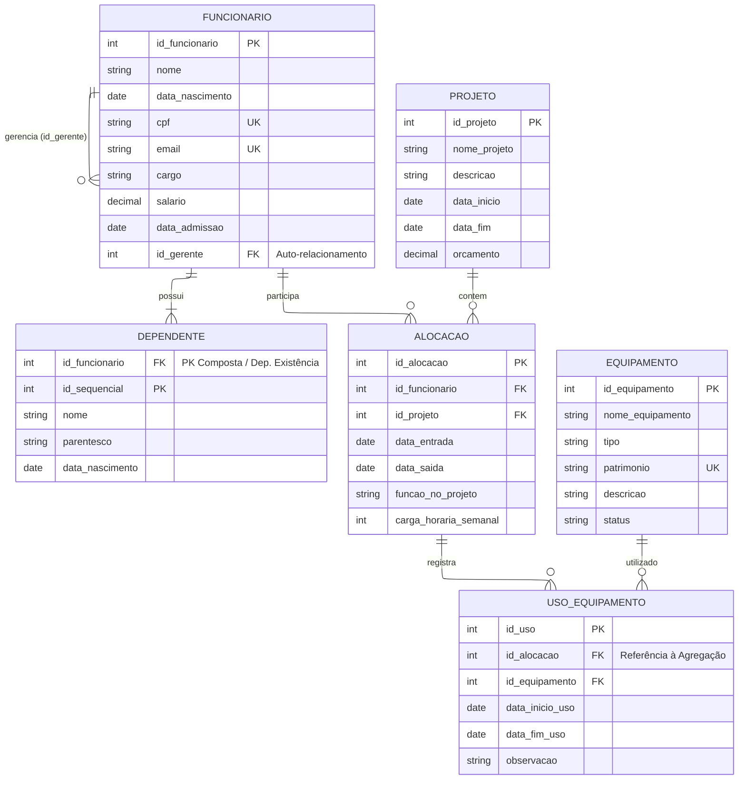

# Projeto BD - Agregação e Autorrelação

## 📚 Descrição do Projeto

Este projeto simula um sistema de gerenciamento de funcionários, projetos e equipamentos em uma empresa, aplicando conceitos de Banco de Dados Relacional, incluindo:

- Autorrelação (funcionário que gerencia outro funcionário)
- Agregação (relação entre funcionário, projeto e uso de equipamentos)
- Normalização e integridade referencial

---

## 🧩 Diagrama MER (Mermaid)

---
🔁 Autorrelação (Supervisor)

A tabela FUNCIONARIO possui um autorrelacionamento através do campo id_gerente, onde:

Um funcionário pode ser gerente de outros funcionários.
Esse relacionamento é representado por uma FK que referencia a própria tabela.
Exemplo de consulta:
SELECT 
    f.nome AS funcionario,
    g.nome AS supervisor
FROM funcionario f
LEFT JOIN funcionario g
ON f.id_gerente = g.id_funcionario;
🧠 Agregação (Funcionário + Projeto + Equipamento)

A agregação ocorre quando o relacionamento entre funcionário e projeto (ALOCACAO) precisa ser expandido para incluir o uso de equipamentos.

Assim, a entidade USO_EQUIPAMENTO representa:

O uso de um equipamento por um funcionário dentro de um projeto específico.

Isso resolve o problema de rastrear qual equipamento foi usado, por quem e em qual projeto.
