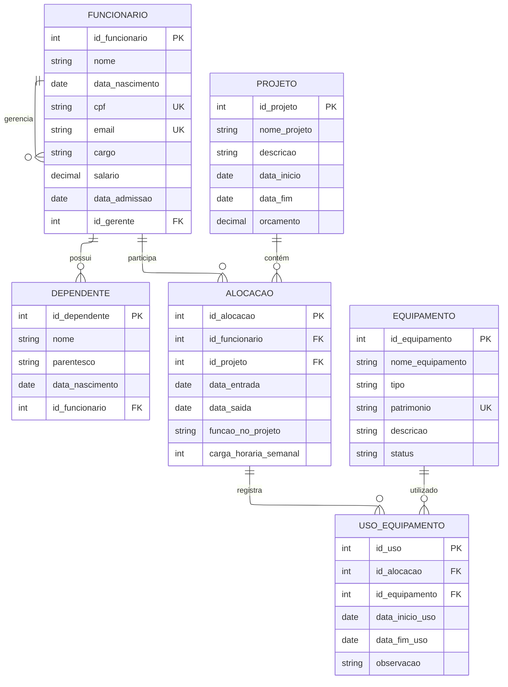

# projeto-bd-agregacao

```mermaid
---
config:
  layout: elk
---
erDiagram
    FUNCIONARIO ||--o{ FUNCIONARIO : gerencia
    FUNCIONARIO ||--o{ DEPENDENTE : possui
    FUNCIONARIO ||--o{ ALOCACAO : participa
    PROJETO ||--o{ ALOCACAO : contém
    ALOCACAO ||--o{ USO_EQUIPAMENTO : registra
    EQUIPAMENTO ||--o{ USO_EQUIPAMENTO : utilizado

    FUNCIONARIO {
        int id_funcionario PK
        string nome
        date data_nascimento
        string cpf UK
        string email UK
        string cargo
        decimal salario
        date data_admissao
        int id_gerente FK
    }

    DEPENDENTE {
        int id_dependente PK
        string nome
        string parentesco
        date data_nascimento
        int id_funcionario FK
    }

    PROJETO {
        int id_projeto PK
        string nome_projeto
        string descricao
        date data_inicio
        date data_fim
        decimal orcamento
    }

    ALOCACAO {
        int id_alocacao PK
        int id_funcionario FK
        int id_projeto FK
        date data_entrada
        date data_saida
        string funcao_no_projeto
        int carga_horaria_semanal
    }

    EQUIPAMENTO {
        int id_equipamento PK
        string nome_equipamento
        string tipo
        string patrimonio UK
        string descricao
        string status
    }

    USO_EQUIPAMENTO {
        int id_uso PK
        int id_alocacao FK
        int id_equipamento FK
        date data_inicio_uso
        date data_fim_uso
        string observacao
    }
```

---
